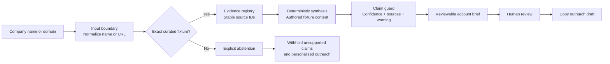

# AccountBrief

AccountBrief turns a company name or domain into a reviewable account brief while keeping every conclusion inside a visible evidence boundary. The current portfolio build uses three fictional organizations, deterministic resolution, claim-level source IDs, explicit confidence, safe abstention, and a required human review before any outreach draft can be used.

**Live demo:** [prasiddhakarki.online/work/account-research](https://prasiddhakarki.online/work/account-research)

> This is an evidence-first product prototype, not a live enrichment service. It does not research real companies, call external data providers, or generate personal contacts.

## What it delivers

- Resolves an exact synthetic company name, domain, or normalized URL to a curated fixture.
- Builds an account brief with an organization summary, industry, size range, pain-point hypotheses, decision-role hypotheses, buying signals, discovery questions, and an outreach draft.
- Attaches confidence, source IDs, and a verification warning to every known-fixture claim.
- Fails closed for unmatched organizations: unsupported facts, roles, signals, and personalized outreach are withheld.
- Uses role hypotheses instead of invented people, email addresses, phone numbers, or reporting relationships.
- Keeps outreach behind a human gate; the only action is copying a draft for review.
- Includes accessible status updates, keyboard focus states, responsive layouts, reduced-motion support, and a written walkthrough summary.

## How it works



The browser-local build makes no live model or research call. Exact aliases resolve to authored fixture data; every other input follows the abstention branch.

## Evidence and confidence design

Each claim carries the same inspectable contract:

| Field | Purpose |
| --- | --- |
| `id` | Stable claim identifier |
| `title` and `detail` | The bounded statement shown to the reviewer |
| `confidence` | `High`, `Medium`, `Low`, or `Unavailable` |
| `sources` | One or more IDs from that fixture's evidence registry |
| `warning` | What remains synthetic, estimated, hypothetical, or unverified |

In the shipped fixtures, direct and consistent synthetic evidence is labeled **High**, directional evidence is labeled **Medium**, and unmatched-company fields are **Unavailable**. `Low` is supported by the schema but is not used to make the included fixtures look more certain than their authored evidence allows. Confidence is a review cue, not a probability or a claim of real-world accuracy.

Source coverage is computed from the fixture data itself. A known claim counts as covered only when it has at least one source ID, every ID resolves inside its fixture registry, and a verification warning is present. The current build reports **100% coverage across 27/27 known-fixture claims**.

## Synthetic fixtures

All fixture domains use the reserved `.example` namespace and describe fictional organizations.

| Fixture | Demonstrated research themes |
| --- | --- |
| Northstar Health Systems | Referral intake, eligibility checks, patient-access operations, and measured workflow discovery |
| ForgeLine Manufacturing | Quality-record reconciliation, maintenance knowledge, traceability, and bounded plant workflows |
| CivicGrid Energy Cooperative | Outage inquiries, program eligibility, governed member-service content, and safety boundaries |

### Deterministic evaluation outcomes

| Check | Outcome | Boundary |
| --- | ---: | --- |
| Known fixture resolution | **6/6** | Each of three fixtures resolves by exact company name and canonical domain |
| Unknown-company abstention | **2/2** | Both unknown inputs return `null` and preserve unknowns |
| Known claims source-indexed | **100% (27/27)** | Every claim has valid source IDs and a warning |
| Personal contacts generated | **0** | No person, email address, phone number, or reporting line is invented |
| External research calls | **0** | Portfolio mode contains no `fetch`-based enrichment path |

These checks verify deterministic portfolio behavior only. They do not establish live-company accuracy, provider coverage, conversion lift, or production readiness.

## Safeguards

- **No fabricated contacts.** The prototype never invents individual names, contact details, or reporting relationships.
- **No live enrichment.** No scraping, tracking, background profiling, or external research API runs in portfolio mode.
- **Unknown means unknown.** An unmatched organization receives no inferred industry, size, pain points, roles, buying signals, or personalized outreach.
- **Inspectable claims.** Known-fixture claims always expose source IDs, confidence, and a warning.
- **Outreach is withheld when evidence is missing.** The unknown path returns a do-not-send message instead of plausible-sounding personalization.
- **Human approval is final.** Nothing is sent, saved to a sales system, or acted on automatically.

## Stack

- Next.js App Router
- React 19 and TypeScript
- CSS Modules
- Deterministic JavaScript fixture resolver
- Source-indexed claim schema
- Browser Clipboard API
- Node.js built-in test runner
- Vinext/Vite and Wrangler in the portfolio host

No model API, enrichment provider, database, or CRM is required for the fixture-mode prototype.

## Run locally

Requirements: Node.js `>=22.13.0` and pnpm.

```bash
corepack enable
pnpm install
pnpm dev
```

Open the URL printed by the development server, then visit `/work/account-research` (typically `http://localhost:3000/work/account-research`). Try a fixture name such as `CivicGrid`, a fixture URL such as `https://www.forgeline.example/about`, and an unmatched company to compare the known and abstention paths.

Run the focused AccountBrief checks:

```bash
node --test tests/account-research.test.mjs
```

Run the host project's complete build and test suite:

```bash
pnpm test
```

Optional static checks:

```bash
pnpm typecheck
pnpm lint
```

See [MANIFEST.md](./MANIFEST.md) for the feature files and demo assets that belong in the repository package.

## Production seams

The prototype deliberately keeps production concerns outside the browser-local fixture. A real deployment would replace or extend these seams without weakening the abstention and review rules:

| Prototype seam | Production implementation |
| --- | --- |
| Exact fixture resolver | Server-side organization resolution with canonical identifiers and ambiguity handling |
| Authored evidence registry | Approved-source ingestion, normalization, timestamps, provenance, and retention controls |
| Deterministic fixture synthesis | Schema-constrained synthesis that can cite only retrieved, authorized evidence |
| In-component claim guard | Independent policy validation that rejects missing, stale, or unresolved citations |
| Browser-only state | Authenticated, tenant-isolated storage with permissions, encryption, and audit logs |
| Clipboard-only outreach | Explicit approval queue, recipient verification, and a separately authorized CRM/send adapter |
| Small fixture evaluation | Versioned golden sets, abstention tests, source-coverage checks, monitoring, and human quality review |

The critical invariant is simple: missing evidence must reduce the output, never invite the system to fill the gap.
# automated-account-research-assistant
Evidence-first company research with source-indexed claims, confidence warnings, buying signals, discovery questions, and human-gated outreach.
